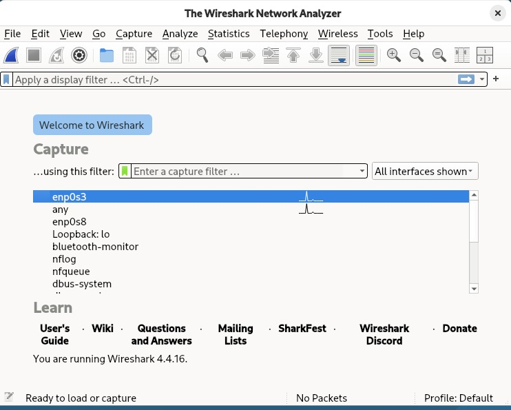
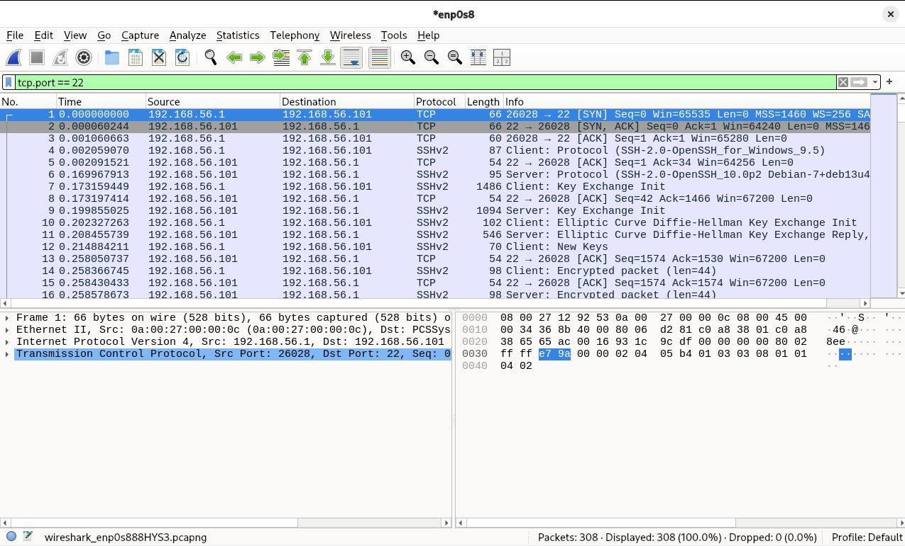
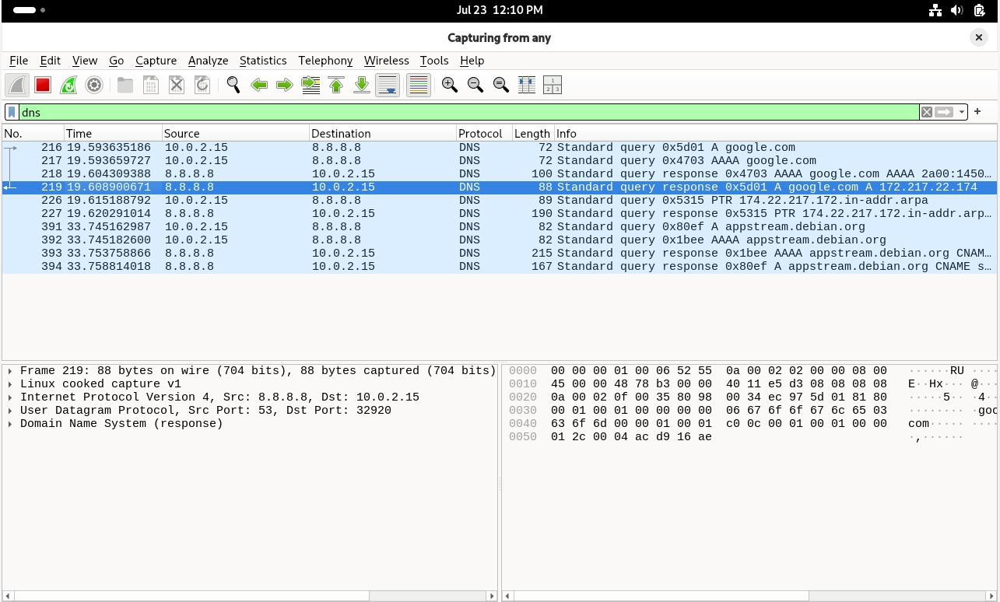
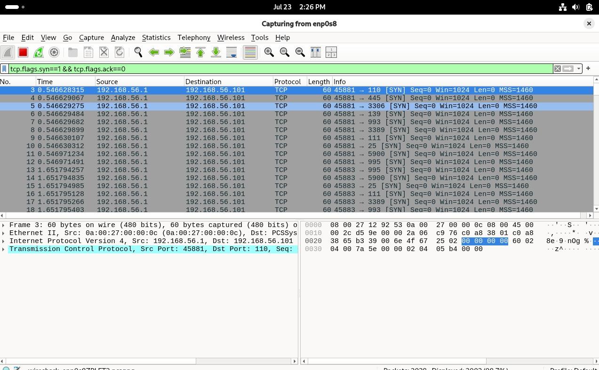
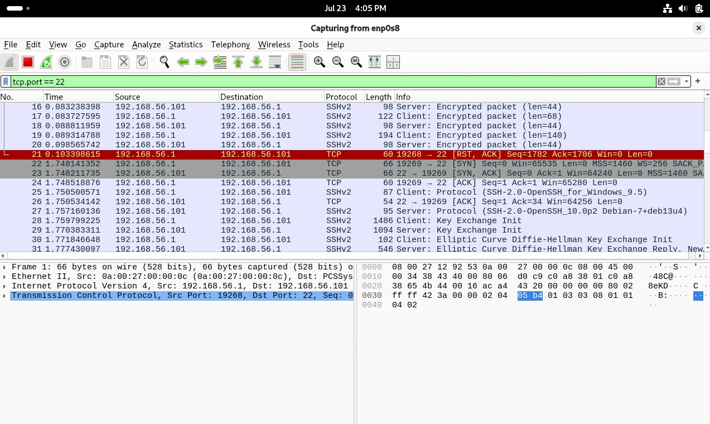
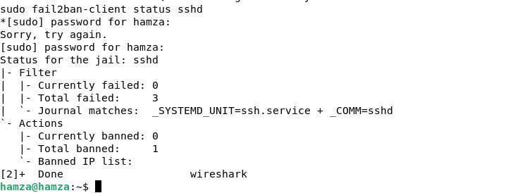
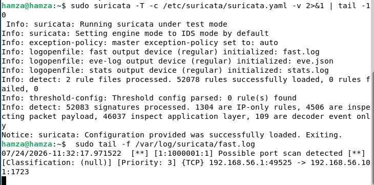

# Network Analysis Lab

Analyse et détection réseau sur un serveur Debian déjà sécurisé (voir [Secure Linux Server Lab](../secure-linux-server-lab)), réalisée dans une VM VirtualBox, avec documentation de chaque étape et des choix effectués.

## Technologies utilisées

- Debian 13
- Linux
- VirtualBox
- Wireshark
- Suricata
- Nmap
- OpenSSH
- Fail2Ban

## Objectif du projet

Ce projet complète le premier lab de sécurisation : après avoir **protégé** un serveur (SSH par clé, pare-feu, fail2ban...), il s'agit maintenant d'apprendre à **observer, comprendre et détecter** ce qui se passe réellement sur le réseau autour de lui. C'est un axe de compétence complémentaire, essentiel en cybersécurité :

- Savoir lire et interpréter du trafic réseau brut (analyse de paquets)
- Reconnaître la différence entre un trafic légitime et un comportement suspect (reconnaissance, brute-force)
- Mettre en place un outil de détection automatique (IDS) capable d'alerter sans intervention humaine

## Environnement

- **Hyperviseur** : VirtualBox
- **Système** : la même VM Debian que le projet 1 (déjà sécurisée : SSH par clé, UFW, Fail2ban)
- **Réseau** : Adaptateur NAT (`enp0s3`) + Adaptateur Host-only (`enp0s8`, IP `192.168.56.101`)
- **Rôle de la machine hôte (Windows)** : joue le rôle de la machine externe qui génère le trafic à observer (connexions SSH, scans nmap, tentatives de brute-force), la VM Debian étant le point d'observation et de détection

---

## Étape 1 — Installation de Wireshark

### Pourquoi

Sans outil d'analyse, le réseau est une boîte noire : les données circulent, mais rien n'est visible. **Wireshark** est un analyseur de paquets ("sniffer") : il intercepte chaque paquet qui passe sur une interface réseau et en affiche le contenu en détail — qui parle à qui, avec quel protocole, quelles données exactement. C'est la brique de base de tout le reste du lab.

### Commandes utilisées

```bash
sudo apt update
sudo apt install wireshark
```

Pendant l'installation, une question apparaît :
> *"Should non-superusers be able to capture packets?"*

Réponse : **Yes**. Capturer des paquets réseau est sensible (interception potentielle de données privées), donc réservé à root par défaut. Répondre Yes configure `dumpcap` pour qu'un utilisateur membre du groupe `wireshark` puisse capturer sans avoir à lancer toute l'application en `sudo` — conforme au principe du moindre privilège déjà appliqué au projet 1.

```bash
sudo usermod -aG wireshark hamza
```

Ajoute l'utilisateur au groupe `wireshark`, qui hérite des permissions nécessaires pour accéder aux interfaces réseau en lecture.

### Vérification

```bash
groups hamza
wireshark &
```

Résultat attendu : la fenêtre Wireshark affiche la liste des interfaces réseau disponibles (`enp0s3`, `enp0s8`, `lo`...).



### Problème rencontré et résolu

Après le `usermod`, une simple reconnexion SSH ne suffisait pas à faire apparaître les interfaces : les groupes Linux sont chargés **au moment de l'ouverture de session**, et Wireshark tournait dans la session graphique GNOME, restée ouverte depuis avant la modification. Résolu par un **redémarrage complet de la VM** (`sudo reboot`), qui a rafraîchi la session graphique et rendu les nouveaux droits actifs.

---

## Étape 2 — Capture de trafic normal (SSH + DNS)

### Pourquoi

Avant de savoir reconnaître une attaque, il faut d'abord savoir à quoi ressemble du trafic **légitime**. On ne peut pas repérer l'anormal sans connaître d'abord la normale. Deux types de trafic très courants sont capturés ici :
- **SSH** : une connexion chiffrée — le handshake est visible, mais pas le contenu échangé ensuite
- **DNS** : une requête en clair — on voit exactement ce qui est demandé et la réponse obtenue

### Marche à suivre

Capture démarrée sur `enp0s8` (interface Host-only, celle qui porte l'IP `192.168.56.101` utilisée pour la connexion SSH depuis l'hôte), puis :

```powershell
ssh hamza@192.168.56.101
```
puis, une fois connecté :
```bash
ping -c 4 google.com
```

### Filtrage et résultat — handshake SSH

Filtre appliqué : `tcp.port == 22`

```
1  192.168.56.1   → 192.168.56.101  TCP     [SYN]      Seq=0
2  192.168.56.101 → 192.168.56.1    TCP     [SYN, ACK] Seq=0 Ack=1
3  192.168.56.1   → 192.168.56.101  TCP     [ACK]      Seq=1 Ack=1
4  192.168.56.1   → 192.168.56.101  SSHv2   Client: Protocol (SSH-2.0-OpenSSH_for_Windows_9.5)
6  192.168.56.101 → 192.168.56.1    SSHv2   Server: Protocol (SSH-2.0-OpenSSH_10.0p2 Debian-7+deb13u4)
7  192.168.56.1   → 192.168.56.101  SSHv2   Client: Key Exchange Init
9  192.168.56.101 → 192.168.56.1    SSHv2   Server: Key Exchange Init
...                                          Encrypted packet (len=44)
```

Le "three-way handshake" (SYN → SYN-ACK → ACK) établit la connexion TCP avant même que SSH n'entre en jeu. Ensuite, les deux machines s'annoncent leur version, négocient les clés de chiffrement (Key Exchange), et à partir de là tout devient illisible (`Encrypted packet`).



### Filtrage et résultat — requête DNS

Filtre appliqué : `dns`

```
10.0.2.15 → 8.8.8.8    Standard query 0x5d01 A google.com
8.8.8.8   → 10.0.2.15  Standard query response 0x5d01 A google.com A 172.217.22.174
```


### Problèmes rencontrés et résolus

**1. Handshake invalide au premier essai** : la première capture montrait une connexion SSH déjà établie *avant* le lancement de Wireshark (protocole affiché directement en `SSHv2`, sans SYN visible) — la connexion existait depuis une étape précédente. Résolu en fermant toutes les connexions SSH ouvertes puis en en ouvrant une nouvelle **après** le démarrage de la capture.

**2. Aucune requête DNS trouvée sur `enp0s8`** : le filtre `dns` ne renvoyait rien. Cause : la requête DNS de `ping google.com` doit sortir vers internet, donc elle passe forcément par `enp0s3` (interface NAT), et non par `enp0s8` (Host-only, isolée d'internet). Résolu en capturant sur l'interface **`any`** (toutes les interfaces à la fois) plutôt que sur une seule interface spécifique.

---

## Étape 3 — Scan nmap capturé en direct

### Pourquoi

Un scan de ports est une opération de **reconnaissance réseau**, souvent la toute première étape d'une attaque réelle : l'attaquant teste une liste de ports pour découvrir quels services tournent sur la machine ciblée. Cette étape permet d'observer la **signature visuelle** de ce comportement dans une capture réseau, pour pouvoir la distinguer d'un trafic normal.

### Marche à suivre

Capture démarrée sur `enp0s8`, puis depuis PowerShell :

```powershell
nmap -sV 192.168.56.101
```

### Filtrage et résultat

Filtre appliqué : `tcp.flags.syn==1 && tcp.flags.ack==0`

```
192.168.56.1 → 192.168.56.101  [SYN]  Dst Port: 110   (POP3)
192.168.56.1 → 192.168.56.101  [SYN]  Dst Port: 445   (SMB)
192.168.56.1 → 192.168.56.101  [SYN]  Dst Port: 3306  (MySQL)
192.168.56.1 → 192.168.56.101  [SYN]  Dst Port: 993
192.168.56.1 → 192.168.56.101  [SYN]  Dst Port: 3389  (RDP)
192.168.56.1 → 192.168.56.101  [SYN]  Dst Port: 111
192.168.56.1 → 192.168.56.101  [SYN]  Dst Port: 25
192.168.56.1 → 192.168.56.101  [SYN]  Dst Port: 5900  (VNC)
...
```

Sur 2028 paquets capturés, 2003 sont des SYN purs : une rafale de tentatives de connexion vers des dizaines de ports différents, envoyée en une fraction de seconde. C'est ce volume et cette diversité de ports qui distinguent un scan d'un usage normal — à comparer avec la connexion SSH de l'étape 2, qui n'avait qu'**un seul** SYN vers **un seul** port. 
                                                                                                                                 
---


## Étape 4 — Brute-force SSH capturé

### Pourquoi

Un brute-force SSH consiste à tester automatiquement de nombreux mots de passe jusqu'à en trouver un valide — une des attaques les plus courantes contre un serveur exposé (déjà expérimentée côté résultat au projet 1, étape 6, avec fail2ban). Ici, l'objectif est d'observer **comment ce comportement se traduit concrètement dans une capture réseau**.

### Marche à suivre

Capture démarrée sur `enp0s8`, puis plusieurs tentatives échouées depuis PowerShell :

```powershell
ssh fakeuser@192.168.56.101
```
(répété plusieurs fois avec un mot de passe erroné)

### Filtrage et résultat

Filtre appliqué : `tcp.port == 22`

```
192.168.56.1   → 192.168.56.101  [SYN]        Src Port: 19268
192.168.56.101 → 192.168.56.1    [SYN, ACK]
192.168.56.1   → 192.168.56.101  [ACK]
...                                            négociation SSH, échec d'authentification
192.168.56.1   → 192.168.56.101  [RST, ACK]    Seq=1782 Ack=1706
192.168.56.1   → 192.168.56.101  [SYN]         Src Port: 19269   ← nouvelle tentative
192.168.56.101 → 192.168.56.1    [SYN, ACK]
192.168.56.1   → 192.168.56.101  [ACK]
...                                            le cycle recommence à l'identique
```

Chaque tentative reproduit un cycle complet (handshake TCP + négociation SSH), qui se termine par un `[RST, ACK]` rapide suivi immédiatement d'un nouveau `[SYN]` sur un nouveau port source. C'est cette **répétition rapide et automatique** du même cycle, à quelques secondes d'intervalle, qui constitue la signature du brute-force — un humain qui se trompe de mot de passe ne relance pas une connexion SSH complète toutes les 1-2 secondes.



### Réaction fail2ban confirmée

```bash
sudo fail2ban-client status sshd
```

```
|- Filter
|  |- Currently failed: 0
|  |- Total failed:     3
|  `- Journal matches:  _SYSTEMD_UNIT=ssh.service + _COMM=sshd
`- Actions
   |- Currently banned: 0
   |- Total banned:     1
```

Fail2ban (configuré au projet 1) a bien détecté les 3 tentatives échouées et banni l'IP source automatiquement — la protection installée précédemment fonctionne exactement comme prévu face à ce test.



---

## Étape 5 — Installation et alerte Suricata

### Pourquoi

Jusqu'ici, c'est un humain (moi) qui a scruté manuellement Wireshark pour repérer le scan et le brute-force. En conditions réelles, personne ne peut surveiller le trafic 24h/24. Un **IDS** (Intrusion Detection System) comme **Suricata** surveille le trafic en continu et déclenche automatiquement une alerte dès qu'il reconnaît un comportement suspect, sur la base de règles de détection. C'est le même principe que fail2ban, mais généralisé à n'importe quel type de trafic réseau, pas seulement SSH.

### Installation

```bash
sudo apt update
sudo apt install suricata -y
sudo systemctl status suricata
ls /etc/suricata/rules/
```

### Problème rencontré et résolu — service en échec au démarrage

Premier démarrage en échec (`Active: failed`, `status=1/FAILURE`). Diagnostic et correction en deux points :

**1. Interface réseau à préciser dans la configuration**

```bash
sudo nano /etc/suricata/suricata.yaml
```

Dans la section `af-packet`, l'interface a été fixée sur celle utilisée par le reste du lab :
```yaml
af-packet:
  - interface: enp0s8
```

**2. Règles de détection manquantes** (avertissement *"No rule files match the pattern .../suricata.rules"*) :

```bash
sudo suricata-update
```
Télécharge un jeu de règles communautaires standard.

```bash
sudo systemctl restart suricata
sudo systemctl status suricata
```

Résultat : `active (running)`.

### Écriture d'une règle de détection personnalisée

Un premier test avec le scan nmap de l'étape 3 n'a déclenché **aucune alerte**, malgré une capture réseau confirmée fonctionnelle (`tcp.syn: 2003` dans les statistiques Suricata) et 52077 règles communautaires bien chargées. Les règles par défaut sont calibrées pour des signatures d'attaques spécifiques et connues, pas pour un simple scan de ports générique.

Une règle personnalisée a donc été écrite :

```bash
sudo nano /var/lib/suricata/rules/custom.rules
```

```
alert tcp any any -> $HOME_NET any (msg:"Possible port scan detected"; flags:S; threshold: type both, track by_src, count 20, seconds 10; sid:1000001; rev:1;)
```

**Explication de la règle** :
- `alert tcp any any -> $HOME_NET any` : surveille tout trafic TCP entrant vers le réseau local
- `flags:S` : ne cible que les paquets marqués SYN (tentatives de connexion)
- `threshold: type both, track by_src, count 20, seconds 10` : déclenche une alerte si une même IP source envoie 20 paquets SYN ou plus en moins de 10 secondes
- `sid:1000001` : identifiant unique obligatoire pour toute règle Suricata

Puis ajout du fichier dans la configuration principale :

```yaml
rule-files:
  - suricata.rules
  - custom.rules
```

```bash
sudo systemctl restart suricata
```

### Problème rencontré et résolu — règle non prise en compte

Après la première correction, l'alerte ne se déclenchait toujours pas. Diagnostic avec :

```bash
sudo suricata -T -c /etc/suricata/suricata.yaml -v
```

Message trouvé : `Warning: detect: No rule files match the pattern /var/lib/suricata/rules/costum.rules`

Deux erreurs cumulées :
- une faute de frappe dans `suricata.yaml` (`costum.rules` au lieu de `custom.rules`)
- le fichier de règle avait été créé dans `/etc/suricata/rules/`, alors que Suricata cherche par défaut dans `/var/lib/suricata/rules/`

Corrigé en plaçant le fichier au bon endroit et en corrigeant l'orthographe :

```bash
sudo cp /etc/suricata/rules/custom.rules /var/lib/suricata/rules/custom.rules
sudo systemctl restart suricata
sudo suricata -T -c /etc/suricata/suricata.yaml -v
```

Résultat : `Info: detect: 2 rule files processed. 52078 rules successfully loaded, 0 rules failed`

### Test final — détection en direct

```bash
sudo tail -f /var/log/suricata/fast.log
```

Puis, depuis PowerShell :
```powershell
nmap -sV 192.168.56.101
```

Résultat obtenu automatiquement dans le log, sans intervention manuelle :

```
07/24/2026-11:32:17.971522 [**] [1:1000001:1] Possible port scan detected [**] [Classification: (null)] [Priority: 3] {TCP} 192.168.56.1:49525 -> 192.168.56.101:1723
```

Suricata a détecté seul, en temps réel, exactement le comportement observé manuellement à l'étape 3 dans Wireshark — la preuve que la détection automatique fonctionne.



---

## Ce que j'ai appris

**Compétences techniques :**
- Capture et lecture de trafic réseau avec Wireshark (interfaces, filtres d'affichage)
- Compréhension du handshake TCP (SYN / SYN-ACK / ACK / RST) et de sa distinction avec l'authentification applicative (SSH)
- Reconnaissance de signatures réseau : trafic normal vs reconnaissance (scan) vs attaque (brute-force)
- Installation, configuration et dépannage d'un IDS (Suricata) : interface de capture, gestion des règles, écriture d'une règle personnalisée
- Diagnostic méthodique de pannes en cascade (service en échec, règle non détectée) via logs et tests de configuration

**Compétences transversales :**
- Construction d'une référence "normale" avant de chercher l'anormal — une démarche d'analyste plutôt que de simple exécutant
- Documentation précise des erreurs et de leur résolution, y compris les plus triviales (faute de frappe, mauvais chemin de fichier) qui bloquent tout un système
- Lien explicite avec le premier projet : vérification concrète que les protections mises en place (fail2ban) réagissent bien face à une attaque simulée et observée

---

## Structure du dépôt

```
network-analysis-lab/
├── README.md
├── 01-wireshark-installed.png
├── 02-ssh-handshake.png
├── 03-dns-query.png
├── 04-nmap-scan-capture.png
├── 05-ssh-bruteforce-capture.png
├── 06-fail2ban-ban-confirmed.png
└── 07-suricata-alert.png
```
## Conclusion

Ce laboratoire complète le projet **Secure Linux Server Lab** en passant de la sécurisation d'un serveur à l'analyse et à la détection du trafic réseau.

Au cours de ce projet, j'ai appris à capturer des paquets avec Wireshark, à distinguer un trafic normal d'un comportement suspect (scan de ports et tentatives de brute-force SSH) et à mettre en place un système de détection d'intrusion avec Suricata.

L'objectif n'était pas seulement d'utiliser ces outils, mais aussi de comprendre leur fonctionnement, de diagnostiquer les problèmes rencontrés et de documenter chaque étape afin de reproduire une méthodologie proche d'un environnement professionnel.  ---
Projet réalisé dans le cadre de mon apprentissage en cybersécurité afin de développer des compétences pratiques en administration système, sécurité Linux et analyse réseau.
